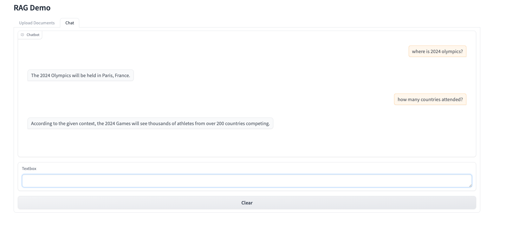

# RAG demo with Llama3

## Prerequisite
You'll need to set up an Huggingface account to download LLama model from transformers


## Install dependencies

1. Now run this command to install dependenies in the `requirements.txt` file. 

    ```python
    pip install -r requirements.txt
    ```

1. Install markdown depenendies with: 

    ```python
    pip install "unstructured[md]"
    ```


## Launch demo UI

1. Launch server

    ```python
    python demo.py
    ```

1. Upload documents

1. query in chat

